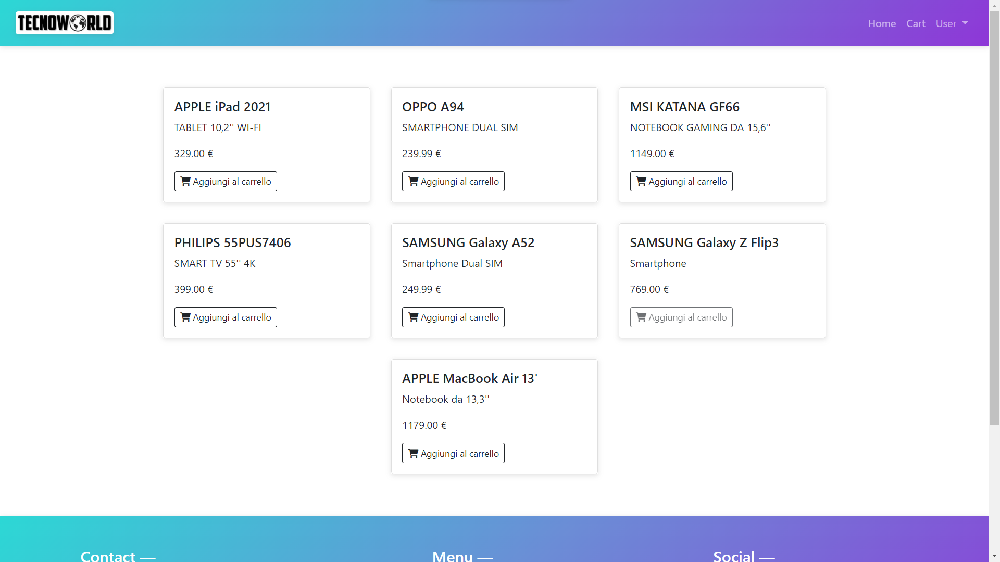

# FullstackProject - Frontend
# Fullstack Project

This project is basically a kind of prototype of a simple ecommerce with also backoffice.

## Link
https://finalproject-frontend.netlify.app

## Getting Started
Open the "fullstack_project" file and in the terminal run `nmp install` then run `ng serve` command in the terminal. Then open your favorite browser and go to this link (http://localhost:4200/) (verify output of terminal and take exactly port number) . 

## Tools Used

Node npm

Angular

Laravel

JWT

## Usage

The usage is very simple, first of all register or log in, then you can see the products, you can add it to cart, you can order them and in the backoffice you can add new product or modify them, or even delete them.

## Angular

This project was generated with [Angular CLI](https://github.com/angular/angular-cli) version 13.3.0.

## Development server

Run `ng serve` for a dev server. Navigate to `http://localhost:4200/`. The application will automatically reload if you change any of the source files.

## Code scaffolding

Run `ng generate component component-name` to generate a new component. You can also use `ng generate directive|pipe|service|class|guard|interface|enum|module`.

## Build

Run `ng build` to build the project. The build artifacts will be stored in the `dist/` directory.

## Running unit tests

Run `ng test` to execute the unit tests via [Karma](https://karma-runner.github.io).

## Running end-to-end tests

Run `ng e2e` to execute the end-to-end tests via a platform of your choice. To use this command, you need to first add a package that implements end-to-end testing capabilities.

## Further help

To get more help on the Angular CLI use `ng help` or go check out the [Angular CLI Overview and Command Reference](https://angular.io/cli) page.
